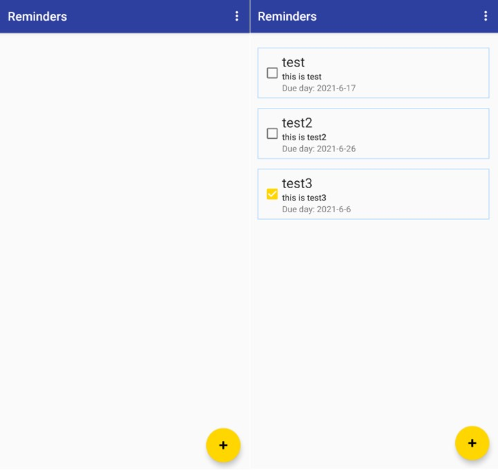
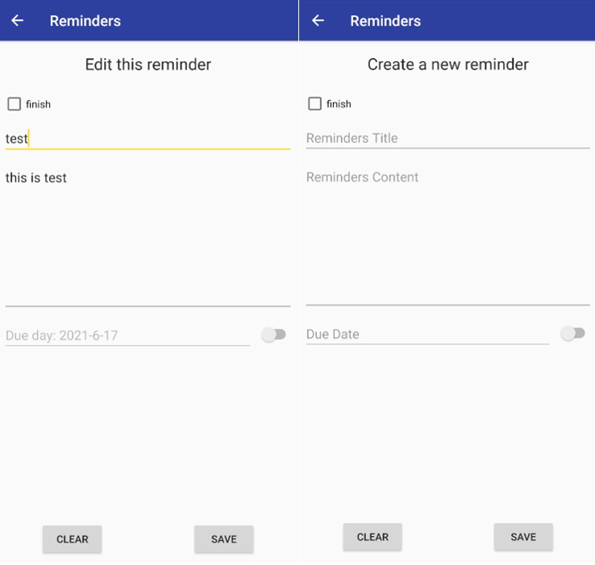
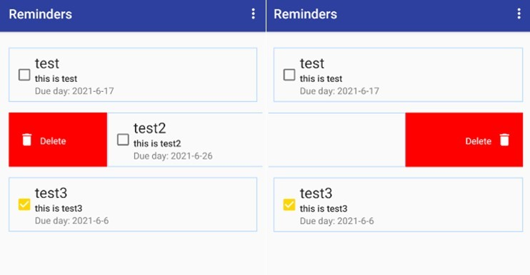

# 10902 Android Final Project

  

日常生活中有許多事情需要處理，但常常事情一多起來就會忘記有哪些需要去做。
所以我們決定開發可以隨時記錄待辦的事情，並設定最後須完成的時間，用來提醒自己還有哪些待辦事項需要完成。

> 我們使用[Practivals for Google's Android Developer Fundamentals Course](https://github.com/MahakAggarwal/Android-Developer-Fundamentals-Version-2)
> 裡面10.1的範例當作我們的初始架構進行開發

## GUI Introduction

剛進入App的畫面

左邊是剛安裝完App以後，主介面會出現的樣子，右邊則是已經有新增過資料的畫面

左邊是點擊新增後會出現的介面，右邊則是點擊任意資料進入的編輯畫面

左右滑動會出現刪除的按鈕

左邊是day mode的畫面，右邊是night mode的畫面

## Function Introduction

- Welcome Page
- See all reminders
- Add a new reminder
- Edit any reminder
- Delete reminder
- Change Day or Night mode

## Achievement Display

### 
You can see demo video in https://youtu.be/aIItXlU_ASM .

## Author

👤 **WUN-JHIH LEE** (108590001) 
👤 **TING-WEI HSU** (107590027)

## License

This project is [GNU General Public License 3.0](https://www.gnu.org/licenses/gpl-3.0.html) licensed.
